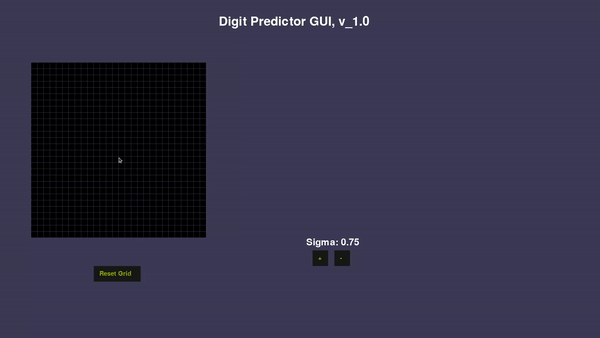

# Digit_Predictor_GUI

This is the app where the user can draw a digit on a grid and then the model predicts the digit and renders the prediction.
This app is built on top of `Numpy`, `Scipy`, `Scikit-Learn`, `TensorFlow` and `Pygame`.
`Scipy` is used for image processing, i.e to process the 28x28 grid to apply Gaussian-Blur filter.
The algorithm used in the ML-model is `Stochastic Gradient Descent Classifier`.
`MNIST` dataset is used to train the model and `joblib` is used to save the model.
Later model is trained with TensorFlow Keras and used for Prediction.

## Installation

Use the package manager [pip](https://pip.pypa.io/en/stable/) to install all the required packages.

```bash
pip install -r requirements.txt
```

## Run Application

```bash
python3 main.py
```

## License

[MIT](https://choosealicense.com/licenses/mit/)


## Demo


